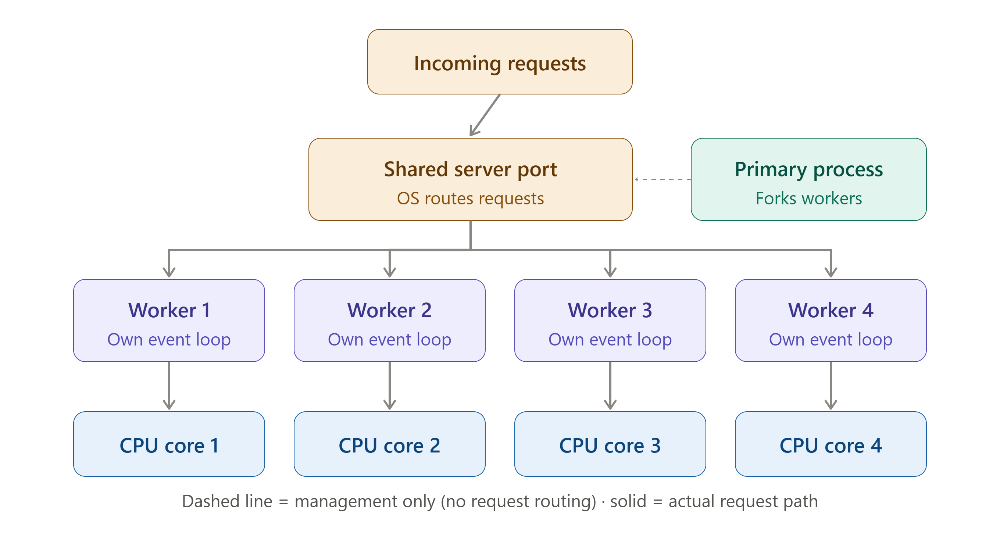

<div align="center">

# 🧩 Cluster Module — Node.js Multi-Core Scaling
### *Single-threaded Node.js ko multi-core CPU ka pura fayda kaise dilaye*

</div>

---

## 📑 Table of Contents

1. [The Problem — Node.js is Single-Threaded](#1-the-problem--nodejs-is-single-threaded)
2. [What is the Cluster Module?](#2-what-is-the-cluster-module)
3. [Cluster Architecture — Master & Workers](#3-cluster-architecture--master--workers)
4. [Basic Cluster Example](#4-basic-cluster-example)
5. [How Load Balancing Works](#5-how-load-balancing-works)
6. [Cluster Events](#6-cluster-events)
7. [Worker Crash Handling & Auto-Restart](#7-worker-crash-handling--auto-restart)
8. [Sharing State Across Workers — The Catch](#8-sharing-state-across-workers--the-catch)
9. [Cluster vs Worker Threads vs Child Process](#9-cluster-vs-worker-threads-vs-child-process)
10. [When to Use Cluster Module](#10-when-to-use-cluster-module)
11. [Interview Questions](#11-interview-questions)
12. [Key Takeaways](#12-key-takeaways)

---

## 1. The Problem — Node.js is Single-Threaded

JavaScript execution Node.js me **single main thread** par hoti hai.

```text
CPU with 8 Cores
┌───┬───┬───┬───┬───┬───┬───┬───┐
│ 1 │ 2 │ 3 │ 4 │ 5 │ 6 │ 7 │ 8 │
└───┴───┴───┴───┴───┴───┴───┴───┘
  ↑
Node.js sirf ISI ek core ko use karta hai
(baaki 7 cores idle rehte hain!)
```

> ⚠️ Agar tumhare server ki machine me **8 CPU cores** hain, aur tum ek simple `node app.js` chala rahe ho, to Node.js by default sirf **1 core** use karega — baaki 7 cores waste ho rahe hain.

Ye ek bada **performance bottleneck** hai high-traffic production servers ke liye.

**Question:** To baaki cores ka use kaise karein?

**Answer:** **Cluster Module** 🧩

---

## 2. What is the Cluster Module?

**Cluster** Node.js ka built-in core module hai.

> ### 💡 Definition
> Cluster module Node.js ko allow karta hai ki wo **multiple child processes (workers)** create kare — jisme har worker apne **alag V8 instance** aur **alag Event Loop** ke saath chalta hai, aur sab ek hi **server port** share karte hain.

```js
import cluster from "node:cluster";
```

**Cluster kya deta hai:**

- 🖥️ Machine ke **saare CPU cores** ka use
- ⚖️ Incoming requests ko **multiple processes** me distribute karna
- 🔁 Ek worker crash ho jaaye to **doosre workers** chalte rehte hain
- 🚀 Overall **throughput** improve hota hai

> ⚠️ **Important:** Cluster **threads** nahi banata — ye **separate OS processes** (child processes) create karta hai. Har process ke paas apna **independent memory space** hota hai.

---

## 3. Cluster Architecture — Master & Workers


```text
                    ┌─────────────────┐
                    │  Master Process  │
                    │  (Primary/Main)  │
                    └────────┬─────────┘
                             │ fork()
       ┌─────────────────────┼─────────────────────┐
       ▼                     ▼                     ▼
┌─────────────┐      ┌─────────────┐      ┌─────────────┐
│  Worker 1   │      │  Worker 2   │      │  Worker 3   │
│ (own V8 +   │      │ (own V8 +   │      │ (own V8 +   │
│ Event Loop) │      │ Event Loop) │      │ Event Loop) │
└─────────────┘      └─────────────┘      └─────────────┘
       │                     │                     │
       └─────────────────────┼─────────────────────┘
                             ▼
                    Same Server Port
                     (e.g. 3000)
```

**Roles:**

| Process | Role |
|---|---|
| **Master Process** | Workers ko `fork()` karta hai, incoming connections distribute karta hai, worker lifecycle manage karta hai |
| **Worker Process** | Actual application code run karta hai, requests handle karta hai — jaise ek normal Node.js server |

> Master khud **koi business logic execute nahi karta** — ye sirf coordinator ki tarah kaam karta hai.

---

## 4. Basic Cluster Example

```js
import cluster from "node:cluster";
import os from "node:os";
import http from "node:http";

const numCPUs = os.cpus().length;

if (cluster.isPrimary) {
    console.log(`Master process ${process.pid} chal raha hai`);

    // CPU cores ke barabar workers fork karo
    for (let i = 0; i < numCPUs; i++) {
        cluster.fork();
    }

    cluster.on("exit", (worker, code, signal) => {
        console.log(`Worker ${worker.process.pid} band ho gaya`);
    });

} else {
    // Ye code har WORKER me chalega
    http.createServer((req, res) => {
        res.writeHead(200);
        res.end(`Handled by worker ${process.pid}`);
    }).listen(3000);

    console.log(`Worker ${process.pid} start hua`);
}
```

**Kya ho raha hai:**

1. `cluster.isPrimary` check karta hai — kya ye Master process hai?
2. Agar **Master** hai → `numCPUs` ke barabar workers `fork()` karo
3. Agar **Worker** hai → normal HTTP server create karo aur port `3000` par listen karo
4. Saare workers **same port** share karte hain — OS/Master requests ko distribute karta hai

```text
node app.js
     ↓
Master detect karta hai: 8 CPU cores hain
     ↓
8 Workers fork() kiye
     ↓
Har Worker apna HTTP server start karta hai, port 3000 par
     ↓
Incoming requests → Master → Round-robin se Workers ko distribute
```

---

## 5. How Load Balancing Works

Master process, incoming connections ko workers ke beech distribute karta hai.

### Linux/macOS — Round-Robin (default)

```text
Request 1 → Worker 1
Request 2 → Worker 2
Request 3 → Worker 3
Request 4 → Worker 1   (cycle repeat hota hai)
```

```text
             Incoming Requests
                    │
                    ▼
             Master Process
                    │
      ┌─────────────┼─────────────┐
      ▼             ▼             ▼
  Worker 1      Worker 2      Worker 3
  (Req 1, 4)    (Req 2)       (Req 3)
```

### Windows — OS-Level Distribution

Windows par by default, OS khud connections ko workers ke beech distribute karta hai (round-robin nahi).

> Round-robin scheduling ko control karne ke liye `cluster.schedulingPolicy` set kiya ja sakta hai:
> ```js
> cluster.schedulingPolicy = cluster.SCHED_RR;   // Round Robin
> cluster.schedulingPolicy = cluster.SCHED_NONE; // OS default
> ```

---

## 6. Cluster Events

Master process, workers ke lifecycle events ko **listen** kar sakta hai:

| Event | Kab Trigger Hota Hai |
|---|---|
| `fork` | Jab ek naya worker fork hota hai |
| `online` | Jab worker process start ho jaata hai |
| `listening` | Jab worker server ek port par listen karna start kare |
| `exit` | Jab worker process band ho jaaye (crash ya normal exit) |
| `disconnect` | Jab worker ka IPC channel disconnect ho |

```js
cluster.on("fork", (worker) => {
    console.log(`Worker ${worker.id} fork hua`);
});

cluster.on("online", (worker) => {
    console.log(`Worker ${worker.process.pid} online hai`);
});

cluster.on("exit", (worker, code, signal) => {
    console.log(`Worker ${worker.process.pid} exit hua, code: ${code}`);
});
```

---

## 7. Worker Crash Handling & Auto-Restart

Ek bada advantage — agar ek worker **crash** ho jaaye, to **baaki workers chalte rehte hain**, aur Master naya worker start kar sakta hai.

```js
cluster.on("exit", (worker, code, signal) => {
    console.log(`Worker ${worker.process.pid} mar gaya. Naya worker start kar rahe hain...`);
    cluster.fork();   // Automatically replace kar do
});
```

```text
Worker 3 crash ho gaya (jaise unhandled exception)
        ↓
Master ko "exit" event mila
        ↓
Master naya Worker fork() karta hai
        ↓
Total workers wapas same count par
        ↓
Baaki Workers (1, 2, 4...) ne kabhi kaam rukne nahi diya
```

> Isse application **high availability** maintain karta hai — ek worker ke crash hone se **poora server down nahi hota**.

---

## 8. Sharing State Across Workers — The Catch

> ⚠️ **Bahut important gotcha!**

Har Worker apna **alag memory space, alag V8 instance** rakhta hai. Isliye:

```js
// ❌ Ye kaam NAHI karega across workers
let requestCount = 0;

http.createServer((req, res) => {
    requestCount++;   // Har worker ka apna alag requestCount hoga!
    res.end(`Count: ${requestCount}`);
}).listen(3000);
```

```text
Worker 1: requestCount = 5   (apna alag copy)
Worker 2: requestCount = 3   (apna alag copy)
Worker 3: requestCount = 7   (apna alag copy)

In-memory variables SHARE nahi hote across workers!
```

**Solution:** Shared state ke liye **external store** use karo:

- 🗄️ **Redis** — shared counters, sessions, cache
- 🗄️ **Database** (MongoDB, PostgreSQL, etc.)
- 📨 **Message Queue** (RabbitMQ, Kafka)

```text
Worker 1 ─┐
Worker 2 ─┼──→  Redis (Shared State)  ←── Single source of truth
Worker 3 ─┘
```

> Session management me bhi yahi problem aati hai — agar sessions **in-memory** store ki jaayein, to User A ka request Worker 1 par jaaye aur next request Worker 2 par jaaye, to session **nahi milega**. Isliye production me **Redis-backed sessions** use karna best practice hai.

---

## 9. Cluster vs Worker Threads vs Child Process

| Feature | Cluster | Worker Threads | Child Process |
|---|---|---|---|
| Kya banata hai | Multiple OS processes | Threads (same process ke andar) | Ek independent OS process |
| Memory | Separate (har process alag) | Shared (`SharedArrayBuffer` possible) | Separate |
| Best for | Multiple servers/requests scale karna | CPU-intensive tasks (parsing, image processing) | External programs run karna, ya isolated tasks |
| Communication | IPC (Inter-Process Communication) | `postMessage()` (lightweight) | IPC |
| Use Case | Web server multi-core scaling | Heavy computation offload karna | Shell commands, external scripts |

```text
Cluster         → "Mujhe zyada requests handle karne hain" (multi-core web server)
Worker Threads  → "Mujhe heavy CPU computation background me karna hai"
Child Process   → "Mujhe ek external command/program run karna hai"
```

---

## 10. When to Use Cluster Module

**✅ Use Cluster jab:**

- Production server multiple CPU cores use karke scale karna ho
- HTTP/API server high traffic handle kar raha ho
- Zero-downtime deployment/restart chahiye ho

**❌ Cluster avoid karo jab:**

- App already ek **process manager** (jaise **PM2**) ke through cluster mode me chal raha ho — usme built-in clustering hoti hai
- Simple scripts ya CLI tools ho jo scaling ki zarurat nahi rakhte
- Serverless environment ho (jaise AWS Lambda) — wahan platform khud scaling handle karta hai

> 💡 **Real-world tip:** Production me raw `cluster` module directly likhne ke bajaye, log **PM2** (`pm2 start app.js -i max`) ya container orchestration (Docker + Kubernetes replicas) use karte hain — jo cluster jaisa hi kaam karte hain, but zyada robust tooling ke saath (logs, monitoring, auto-restart, zero-downtime reload).

---

## 11. Interview Questions

**Q1. What is the Cluster module in Node.js?**
> The Cluster module allows Node.js to create multiple child processes (workers), each with its own V8 instance and Event Loop, that share the same server port — enabling an application to take advantage of multi-core CPU systems.

**Q2. Does Cluster use threads or processes?**
> Cluster creates separate OS processes (via `fork()`), not threads. Each worker process has its own independent memory space.

**Q3. How does load balancing work in Cluster module?**
> On Linux and macOS, the Master process uses round-robin scheduling by default to distribute incoming connections across worker processes. On Windows, the OS handles distribution directly.

**Q4. What happens if a worker crashes?**
> The Master process receives an `exit` event for that worker. The other workers continue running unaffected, and the Master can be configured to automatically fork a replacement worker.

**Q5. Can workers share in-memory variables?**
> No. Each worker has its own separate memory space and V8 instance, so in-memory variables are not shared across workers. Shared state must be managed externally, using something like Redis or a database.

**Q6. What is the difference between Cluster and Worker Threads?**
> Cluster spawns multiple independent OS processes primarily to scale a server across CPU cores for handling more requests, with no shared memory. Worker Threads run within the same process and can share memory (via SharedArrayBuffer), and are better suited for offloading CPU-intensive computations.

**Q7. Why might production teams prefer PM2 over directly using the Cluster module?**
> PM2 provides clustering along with additional production-grade tooling — process monitoring, automatic restarts, log management, and zero-downtime reloads — reducing the need to manually implement these features with the raw Cluster API.

---

## 12. Key Takeaways

- ✅ Node.js JavaScript execution is single-threaded — by default it uses only one CPU core.
- ✅ The **Cluster module** lets Node.js fork multiple worker processes to use all available CPU cores.
- ✅ Each worker has its own V8 instance, its own Event Loop, and its own memory space.
- ✅ The **Master process** forks workers and distributes incoming connections (round-robin on Linux/macOS).
- ✅ If a worker crashes, other workers keep running — the Master can auto-restart the crashed one.
- ✅ In-memory state is **not shared** across workers — use Redis, a database, or a message queue for shared data.
- ✅ Cluster (processes) is different from Worker Threads (threads within one process) and Child Process (running external programs).
- ✅ In production, tools like **PM2** or container orchestration are commonly used instead of raw `cluster` code.